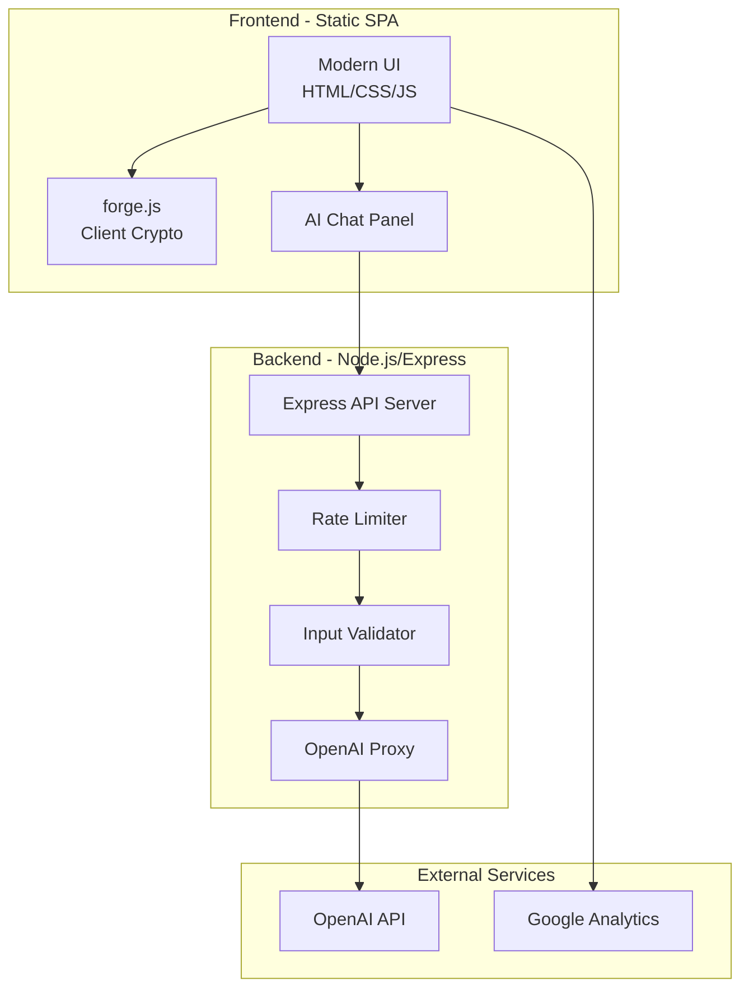
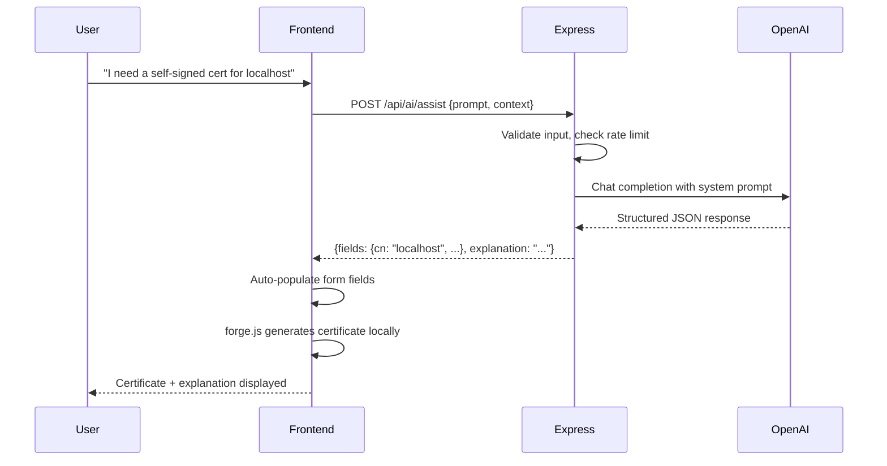
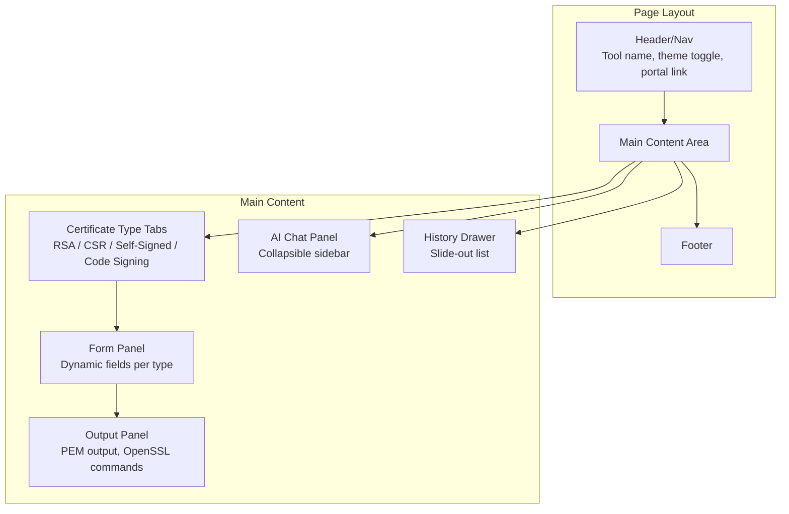
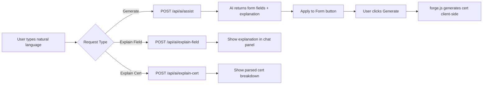
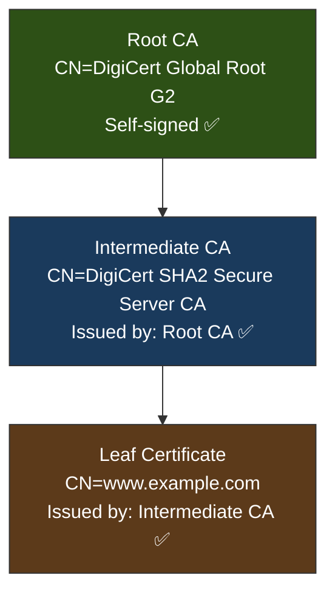
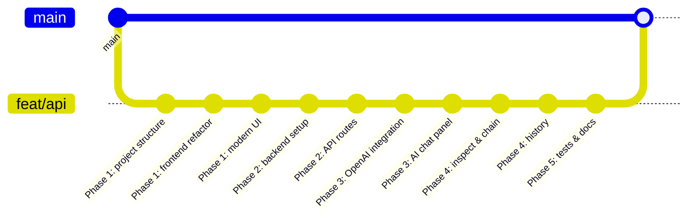
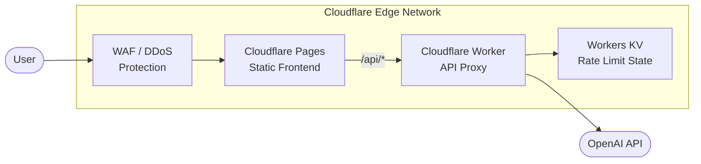
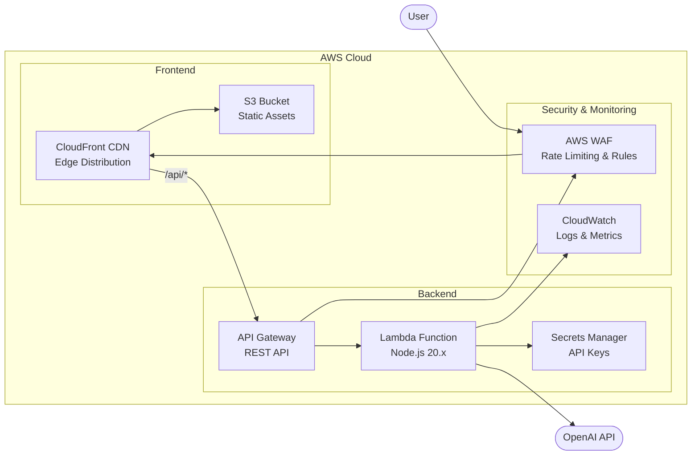
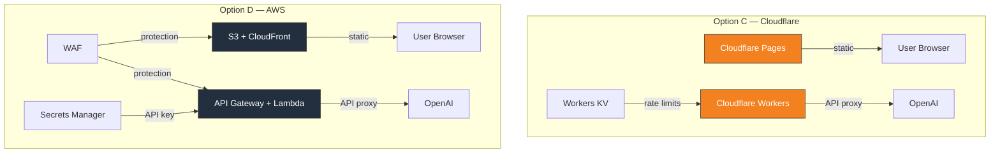
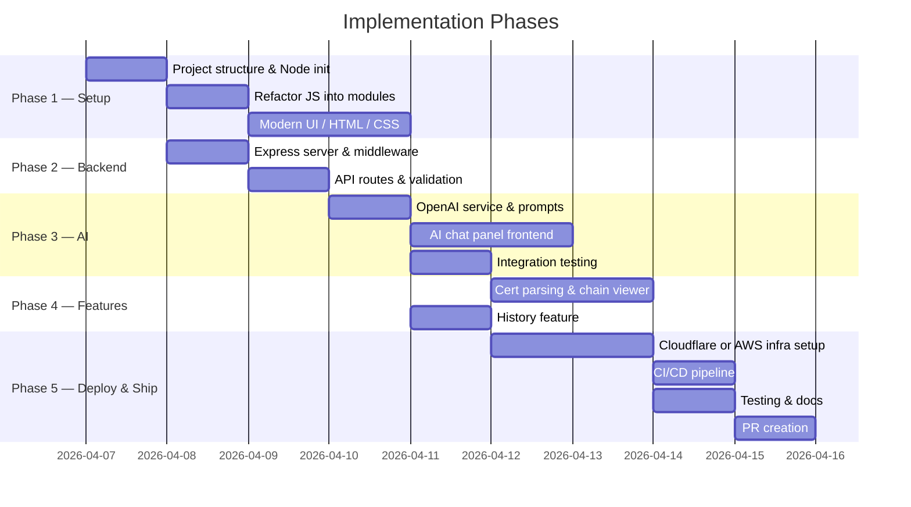

# API Conversion Plan — Certificate Tool to Full Website with OpenAI Backend

> **Status:** Planning
> **Branch:** `feat/api`
> **Created:** 2026-04-06
> **Last Updated:** 2026-04-06

---

## Executive Summary

Convert the static client-side certificate generation tool at `Websites/CreateCertificate/` into a modern, full-stack web application with a Node.js/Express backend that proxies OpenAI API calls. The AI integration will provide natural-language certificate generation, field explanation, and certificate analysis capabilities.

---

## Current State Analysis

The existing tool is a single-page static site consisting of three files:

| File | Purpose |
|------|---------|
| `create_certificate.html` | Form-based UI with dropdown for cert type (RSA, CSR, Self-Signed, Code Signing) |
| `create_certificate.js` | All logic client-side using `forge.js` (CDN v0.10.0) for crypto operations, plus OpenSSL command generation, clipboard, and download utilities |
| `styles.css` | Minimal styling (green buttons, white cards, grey background) |

**Key observations:**
- Country list is hardcoded to South Africa only (REST Countries API call is commented out)
- `escapeHtml()` utility is duplicated across CreateCertificate, InspectCertificate, and InspectCSR — candidate for shared code
- Google Analytics tag `G-2Z62LEVC4T` is active
- `.gitignore` already accounts for `node_modules/`, `.env`, and secret files
- Certificate generation is entirely client-side via `forge.js` — this stays client-side for privacy

---

## Architecture Overview



---

## API Request Flow



---

## Target Project Structure

```
Websites/CreateCertificate/
├── server/
│   ├── package.json
│   ├── server.js                  # Express entry point
│   ├── .env.example               # Template for env vars (committed)
│   ├── routes/
│   │   ├── ai.js                  # /api/ai/* routes
│   │   └── health.js              # /api/health
│   ├── middleware/
│   │   ├── rateLimiter.js         # express-rate-limit config
│   │   ├── validator.js           # Input sanitization
│   │   └── cors.js                # CORS configuration
│   ├── services/
│   │   └── openai.js              # OpenAI client wrapper
│   └── prompts/
│       ├── assistant.js           # System prompt for cert assistant
│       └── explainer.js           # System prompt for cert explainer
├── public/
│   ├── index.html                 # Main SPA entry
│   ├── css/
│   │   ├── main.css               # Core layout and design tokens
│   │   └── components.css         # Component-specific styles
│   ├── js/
│   │   ├── app.js                 # App initialization, routing
│   │   ├── certificate.js         # Certificate generation logic
│   │   ├── ai-chat.js             # AI chat panel logic
│   │   ├── history.js             # LocalStorage history management
│   │   ├── countries.js           # Country list data (static)
│   │   └── utils.js               # Shared utilities
│   └── lib/
│       └── forge.min.js           # Local copy of forge.js
├── API_Conversion.md              # This plan
├── README.md
└── Dockerfile                     # Optional containerized deployment
```

---

## Phase 1: Project Setup & Modern Website Conversion

### 1.1 — Initialize Node.js Project

| Task | Description | Output |
|------|-------------|--------|
| 1.1.1 | Create `server/` directory with `package.json` | `server/package.json` |
| 1.1.2 | Install dependencies: `express`, `cors`, `helmet`, `express-rate-limit`, `openai`, `dotenv` | `server/node_modules/` |
| 1.1.3 | Install dev dependencies: `nodemon`, `eslint` | — |
| 1.1.4 | Create `.env.example` with placeholder keys | `server/.env.example` |
| 1.1.5 | Create basic `server.js` serving `public/` as static files | `server/server.js` |

### 1.2 — Restructure Frontend

| Task | Description | Output |
|------|-------------|--------|
| 1.2.1 | Create `public/` directory tree (`css/`, `js/`, `lib/`) | Directory structure |
| 1.2.2 | Extract `escapeHtml`, `copyToClipboard`, `downloadContent`, `getCurrentDate` into `utils.js` | `public/js/utils.js` |
| 1.2.3 | Extract certificate generation logic into `certificate.js` | `public/js/certificate.js` |
| 1.2.4 | Create static country list (restore commented-out data as hardcoded array) | `public/js/countries.js` |
| 1.2.5 | Vendor `forge.js` locally instead of CDN | `public/lib/forge.min.js` |
| 1.2.6 | Create new `index.html` as modern SPA entry | `public/index.html` |
| 1.2.7 | Create `app.js` for initialization and routing | `public/js/app.js` |

### 1.3 — Modern UI Redesign

**Design direction:** Clean, professional tool aesthetic. Dark sidebar or top nav, card-based layout, monospace output areas. Keep the existing green accent color (`#5cb85c`) for continuity.

| Task | Description | Output |
|------|-------------|--------|
| 1.3.1 | Implement responsive CSS Grid/Flexbox layout | `public/css/main.css` |
| 1.3.2 | Create two-panel layout: left=form, right=AI assistant | `public/css/main.css` |
| 1.3.3 | Tabbed interface for certificate types (replace dropdown) | `public/css/components.css` |
| 1.3.4 | Styled output blocks with syntax highlighting for PEM content | `public/css/components.css` |
| 1.3.5 | Toast notifications instead of `alert()` for clipboard feedback | `public/js/utils.js` |
| 1.3.6 | Mobile-first responsive breakpoints (320px, 768px, 1024px, 1440px) | CSS media queries |
| 1.3.7 | Dark/light mode toggle using CSS custom properties | `public/css/main.css` |

**Key UI Components:**



### 1.4 — Preserve Google Analytics

Keep the existing GA tag `G-2Z62LEVC4T` in the new `index.html`. No changes to tracking ID.

---

## Phase 2: API Backend

### 2.1 — Express Server Setup

| Task | Description | Output |
|------|-------------|--------|
| 2.1.1 | Create Express app with `dotenv` config | `server/server.js` |
| 2.1.2 | Apply `helmet` middleware for HTTP security headers | `server/server.js` |
| 2.1.3 | Configure CORS with whitelisted origins from env | `server/middleware/cors.js` |
| 2.1.4 | Apply `express.json({ limit: '50kb' })` body parser | `server/server.js` |
| 2.1.5 | Mount route modules | `server/server.js` |
| 2.1.6 | Serve `public/` as static files | `server/server.js` |

### 2.2 — API Endpoints

| Method | Path | Purpose | Rate Limit |
|--------|------|---------|------------|
| `GET` | `/api/health` | Health check | None |
| `POST` | `/api/ai/assist` | Natural language → cert config | 10/min/IP |
| `POST` | `/api/ai/explain-field` | Explain a certificate field | 20/min/IP |
| `POST` | `/api/ai/explain-cert` | Parse & explain a pasted certificate | 10/min/IP |
| `POST` | `/api/ai/suggest` | Suggest cert config for a use case | 10/min/IP |

**Request/Response Contracts:**

#### `POST /api/ai/assist`

```json
// Request
{
  "prompt": "I need a self-signed cert for my dev server at localhost",
  "currentForm": { "certType": "selfSigned", "keySize": 2048 }
}

// Response
{
  "fields": {
    "certType": "selfSigned",
    "commonName": "localhost",
    "altNames": ["localhost", "127.0.0.1"],
    "keySize": 2048,
    "validityPeriod": 1,
    "signatureAlg": "SHA256withRSA"
  },
  "explanation": "For a local development server, a self-signed certificate with CN=localhost is standard. I've added 127.0.0.1 as a SAN since browsers check SANs. 2048-bit RSA with SHA-256 is sufficient for development use.",
  "warnings": [
    "Self-signed certificates will show browser warnings. For production, use a CA-signed certificate or Let's Encrypt."
  ]
}
```

#### `POST /api/ai/explain-cert`

```json
// Request
{
  "certificate": "-----BEGIN CERTIFICATE-----\nMIID...\n-----END CERTIFICATE-----"
}

// Response
{
  "summary": "This is a self-signed X.509v3 certificate...",
  "details": {
    "subject": "CN=example.com, O=Example Inc",
    "issuer": "CN=example.com, O=Example Inc (self-signed)",
    "validity": "2024-01-01 to 2025-01-01",
    "keyType": "RSA 2048-bit",
    "signatureAlgorithm": "SHA-256 with RSA",
    "extensions": ["Basic Constraints: CA:FALSE"]
  },
  "warnings": ["Certificate expires in 45 days", "Uses self-signed issuer"],
  "recommendations": ["Consider upgrading to 4096-bit key for production"]
}
```

#### `POST /api/ai/explain-field`

```json
// Request
{
  "field": "subjectAltName",
  "context": "CSR"
}

// Response
{
  "field": "subjectAltName",
  "explanation": "Subject Alternative Names (SANs) specify additional hostnames or IPs that the certificate is valid for...",
  "bestPractices": ["Always include the CN as a SAN", "Use DNS type for hostnames, IP type for IP addresses"],
  "example": "DNS:www.example.com, DNS:example.com, IP:192.168.1.1"
}
```

### 2.3 — Security Middleware

| Task | Description | Output |
|------|-------------|--------|
| 2.3.1 | Rate limiter with per-endpoint configs | `server/middleware/rateLimiter.js` |
| 2.3.2 | Input validator: sanitize strings, enforce max lengths (prompt: 500 chars, cert: 10KB), reject unexpected fields | `server/middleware/validator.js` |
| 2.3.3 | CORS whitelist configurable via env | `server/middleware/cors.js` |

**Security Checklist:**

- [ ] API key stored only in `.env`, never exposed to frontend
- [ ] `helmet` middleware for HTTP security headers
- [ ] Input length limits to prevent abuse
- [ ] Rate limiting per IP per endpoint
- [ ] No certificate content forwarded to OpenAI unless user explicitly requests explanation
- [ ] CSP header updated to allow `connect-src` to backend API origin
- [ ] Request body size limit via `express.json({ limit: '50kb' })`

### 2.4 — Environment Configuration

**`.env.example`:**

```env
OPENAI_API_KEY=sk-your-key-here
OPENAI_MODEL=gpt-4o-mini
PORT=3000
CORS_ORIGINS=http://localhost:3000
NODE_ENV=development
RATE_LIMIT_WINDOW_MS=60000
RATE_LIMIT_MAX=10
```

> Use `gpt-4o-mini` as default model — cost-effective and fast enough for certificate field explanations and NL parsing. Allow override via env var.

---

## Phase 3: OpenAI Integration

### 3.1 — System Prompts

| Task | Description | Output |
|------|-------------|--------|
| 3.1.1 | Create certificate assistant system prompt (PKI expert, structured JSON output, warns about insecure options) | `server/prompts/assistant.js` |
| 3.1.2 | Create certificate explainer system prompt (analyst role, PEM input, human-readable breakdown) | `server/prompts/explainer.js` |

### 3.2 — OpenAI Service

| Task | Description | Output |
|------|-------------|--------|
| 3.2.1 | Initialize OpenAI client with API key from env | `server/services/openai.js` |
| 3.2.2 | Create `assistWithCertificate()` wrapper | `server/services/openai.js` |
| 3.2.3 | Create `explainField()` wrapper | `server/services/openai.js` |
| 3.2.4 | Create `explainCertificate()` wrapper | `server/services/openai.js` |
| 3.2.5 | Create `suggestConfig()` wrapper | `server/services/openai.js` |
| 3.2.6 | Use JSON mode for consistent structured output | `server/services/openai.js` |
| 3.2.7 | Error handling: graceful degradation if OpenAI unavailable | `server/services/openai.js` |
| 3.2.8 | Token budget: `max_tokens` per endpoint (assist: 500, explain-cert: 1000) | `server/services/openai.js` |
| 3.2.9 | 30-second timeout on OpenAI calls | `server/services/openai.js` |

### 3.3 — Frontend AI Chat Panel

| Task | Description | Output |
|------|-------------|--------|
| 3.3.1 | Create collapsible chat panel on right side | `public/js/ai-chat.js` |
| 3.3.2 | "Explain this field" — click any form label to get AI explanation | `public/js/ai-chat.js` |
| 3.3.3 | "Suggest config for..." — free text input | `public/js/ai-chat.js` |
| 3.3.4 | "Explain my certificate" — paste a cert for analysis | `public/js/ai-chat.js` |
| 3.3.5 | Auto-populate form: "Apply" button fills form from AI response | `public/js/ai-chat.js` |
| 3.3.6 | Session conversation history (not persisted) | `public/js/ai-chat.js` |
| 3.3.7 | Loading skeleton animation during API calls | `public/css/components.css` |
| 3.3.8 | Error state with retry option | `public/js/ai-chat.js` |

### 3.4 — AI Interaction Flow



---

## Phase 4: Enhanced Features

### 4.1 — Certificate Validation & Parsing

| Task | Description | Output |
|------|-------------|--------|
| 4.1.1 | Add "Inspect" tab alongside Generate tabs | `public/index.html` |
| 4.1.2 | Integrate parsing logic from `InspectCertificate/inspect_certificate.js` | `public/js/certificate.js` |
| 4.1.3 | Paste or upload a certificate → parse client-side with forge.js | `public/js/certificate.js` |
| 4.1.4 | Optionally send to AI for human-readable explanation | `public/js/ai-chat.js` |

### 4.2 — Certificate Chain Viewer

| Task | Description | Output |
|------|-------------|--------|
| 4.2.1 | Accept multiple PEM certificates (chain) | `public/js/certificate.js` |
| 4.2.2 | Parse each cert, display subject/issuer relationships | `public/js/certificate.js` |
| 4.2.3 | Visual chain diagram using CSS (no external charting lib) | `public/css/components.css` |
| 4.2.4 | Highlight broken chains (issuer mismatch) | `public/js/certificate.js` |



### 4.3 — Generation History (LocalStorage)

| Task | Description | Output |
|------|-------------|--------|
| 4.3.1 | Store last 50 generated certificates in `localStorage` | `public/js/history.js` |
| 4.3.2 | Each entry: timestamp, cert type, CN, key size, truncated fingerprint | `public/js/history.js` |
| 4.3.3 | **Do NOT store private keys in history** (security) | — |
| 4.3.4 | "Re-generate" button to pre-fill form from previous settings | `public/js/history.js` |
| 4.3.5 | "Clear History" button | `public/js/history.js` |
| 4.3.6 | Export history as JSON | `public/js/history.js` |

---

## Phase 5: Deployment & PR

### 5.1 — Git Workflow



### 5.2 — Testing Strategy

**Backend tests (manual initially, automated later):**

- [ ] Health endpoint returns 200
- [ ] Rate limiter blocks after threshold
- [ ] Input validator rejects oversized/malformed requests
- [ ] OpenAI proxy handles API errors gracefully (timeout, 429, 500)
- [ ] CORS blocks unauthorized origins

**Frontend tests (manual):**

- [ ] All four certificate types generate valid output
- [ ] AI chat panel sends/receives correctly
- [ ] Form auto-populate from AI response works
- [ ] Copy/download functions work
- [ ] Responsive layout at 320px, 768px, 1024px, 1440px
- [ ] History persists across page reloads
- [ ] Dark/light mode toggle works

### 5.3 — Deployment Options

| Option | Frontend | Backend | Pros | Cons |
|--------|----------|---------|------|------|
| **A** | GitHub Pages (`public/`) | Railway / Render / Vercel serverless | Matches existing pattern, free static hosting | Two deployments to manage |
| **B** | Express serves static | Single Node.js on Railway/Render | Simpler single deployment | Requires always-on server |
| **C (Recommended)** | Cloudflare Pages | Cloudflare Workers | Global edge CDN, generous free tier (100k req/day), built-in DDoS protection, Workers KV for rate limiting | Vendor lock-in to Cloudflare, Workers runtime has some Node.js API limitations |
| **D** | AWS CloudFront + S3 | API Gateway + Lambda | Enterprise-grade, full AWS ecosystem, pay-per-request, IAM for fine-grained access | More complex setup, AWS billing complexity, cold starts on Lambda |

**Recommendation:** Option C (Cloudflare) for simplicity and cost, or Option D (AWS) for enterprise-grade infrastructure.

---

#### Option C: Cloudflare Pages + Workers (Recommended)



**Architecture:**
- **Cloudflare Pages**: Deploys `public/` directly from Git. Auto-builds on push to `feat/api`. Custom domain with free SSL.
- **Cloudflare Workers**: Serverless functions at the edge. Handles `/api/*` routes. API key stored in Workers Secrets (encrypted env vars).
- **Workers KV**: Key-value store for rate limiting state (IP + timestamp tracking). Free tier: 100k reads/day, 1k writes/day.
- **Cloudflare WAF**: Free tier includes basic bot protection, DDoS mitigation, and IP-based rules.

**Deployment tasks:**

| Task | Description | Output |
|------|-------------|--------|
| 5.3.C1 | Create `wrangler.toml` config for Workers | `server/wrangler.toml` |
| 5.3.C2 | Adapt Express routes to Workers `fetch()` handler | `server/worker.js` |
| 5.3.C3 | Store `OPENAI_API_KEY` as a Worker Secret via `wrangler secret put` | — |
| 5.3.C4 | Configure Workers KV namespace for rate limiting | `wrangler.toml` |
| 5.3.C5 | Connect Cloudflare Pages to Git repo, set `public/` as build output | Cloudflare dashboard |
| 5.3.C6 | Configure Pages Functions or Worker route for `/api/*` | `wrangler.toml` |
| 5.3.C7 | Set custom domain (optional) | Cloudflare DNS |

**`wrangler.toml` (example):**

```toml
name = "cert-tool-api"
main = "server/worker.js"
compatibility_date = "2026-04-06"

[vars]
OPENAI_MODEL = "gpt-4o-mini"
RATE_LIMIT_MAX = "10"

[[kv_namespaces]]
binding = "RATE_LIMIT"
id = "<kv-namespace-id>"

# Secrets (set via CLI, not in file):
# OPENAI_API_KEY
```

**`server/worker.js` structure:**

```js
export default {
  async fetch(request, env, ctx) {
    const url = new URL(request.url);
    if (url.pathname.startsWith('/api/')) {
      // Rate limit check via KV
      // Route to handler
      // Proxy to OpenAI with env.OPENAI_API_KEY
    }
    // Static assets handled by Pages
    return new Response('Not found', { status: 404 });
  }
};
```

**Cost estimate (free tier):**
- Cloudflare Pages: Free (unlimited sites, 500 builds/month)
- Workers: Free (100k requests/day, 10ms CPU per request)
- Workers KV: Free (100k reads/day, 1k writes/day)
- Custom domain: Free (if DNS on Cloudflare)
- **Total: $0/month** for moderate traffic

---

#### Option D: AWS CloudFront + S3 + API Gateway + Lambda



**Architecture:**
- **S3**: Hosts `public/` as a static website. Private bucket, accessed only through CloudFront (OAC).
- **CloudFront**: Global CDN with edge caching. Custom domain + ACM SSL cert. `/api/*` origin routed to API Gateway.
- **API Gateway**: REST API with request validation, throttling (10 req/sec default), and usage plans.
- **Lambda**: Node.js 20.x function running the Express API (via `@vendia/serverless-express` or `aws-lambda-web-adapter`). API key fetched from Secrets Manager at cold start, cached in memory.
- **Secrets Manager**: Stores `OPENAI_API_KEY` encrypted. Lambda IAM role has read-only access.
- **WAF**: Attached to both CloudFront and API Gateway. Rate-based rules (block IPs exceeding threshold), geo-blocking (optional), SQL injection / XSS protection.
- **CloudWatch**: Lambda logs, API Gateway access logs, custom metrics for OpenAI call latency.

**Deployment tasks:**

| Task | Description | Output |
|------|-------------|--------|
| 5.3.D1 | Create S3 bucket with static website hosting disabled (private, OAC only) | IaC template |
| 5.3.D2 | Create CloudFront distribution with S3 OAC origin + API Gateway origin | IaC template |
| 5.3.D3 | Configure CloudFront behaviors: `default (*)` → S3, `/api/*` → API Gateway | IaC template |
| 5.3.D4 | Create Lambda function from `server/` code | `server/lambda.js` |
| 5.3.D5 | Create API Gateway REST API with `/api/{proxy+}` resource | IaC template |
| 5.3.D6 | Store `OPENAI_API_KEY` in Secrets Manager | AWS CLI |
| 5.3.D7 | Create Lambda IAM role with Secrets Manager read + CloudWatch write | IaC template |
| 5.3.D8 | Attach WAF WebACL with rate-based rule (2000 req/5min per IP) | IaC template |
| 5.3.D9 | Create ACM certificate for custom domain (optional) | AWS Console / CLI |
| 5.3.D10 | Create CloudFormation / SAM / CDK template for full stack | `infra/template.yaml` |
| 5.3.D11 | CI/CD: GitHub Actions workflow to deploy on push to `feat/api` | `.github/workflows/deploy.yml` |

**`server/lambda.js` (adapter):**

```js
import serverlessExpress from '@vendia/serverless-express';
import app from './server.js';

// Cache Secrets Manager value across warm invocations
let cachedHandler;

export const handler = async (event, context) => {
  if (!cachedHandler) {
    // Fetch API key from Secrets Manager on cold start
    cachedHandler = serverlessExpress({ app });
  }
  return cachedHandler(event, context);
};
```

**SAM template structure (`infra/template.yaml`):**

```yaml
AWSTemplateFormatVersion: '2010-09-09'
Transform: AWS::Serverless-2016-10-31

Globals:
  Function:
    Runtime: nodejs20.x
    Timeout: 30
    MemorySize: 256

Resources:
  # S3 bucket for static frontend
  FrontendBucket:
    Type: AWS::S3::Bucket
    Properties:
      BucketName: cert-tool-frontend
      PublicAccessBlockConfiguration:
        BlockPublicAcls: true
        BlockPublicPolicy: true

  # Lambda function
  ApiFunction:
    Type: AWS::Serverless::Function
    Properties:
      Handler: server/lambda.handler
      Events:
        ApiProxy:
          Type: Api
          Properties:
            Path: /api/{proxy+}
            Method: ANY
      Environment:
        Variables:
          OPENAI_MODEL: gpt-4o-mini
          SECRET_ARN: !Ref OpenAISecret
      Policies:
        - SecretsManagerReadPolicy:
            SecretArn: !Ref OpenAISecret

  # Secrets Manager
  OpenAISecret:
    Type: AWS::SecretsManager::Secret
    Properties:
      Name: cert-tool/openai-api-key

  # CloudFront distribution
  CDN:
    Type: AWS::CloudFront::Distribution
    Properties:
      DistributionConfig:
        Origins:
          - Id: S3Origin
            DomainName: !GetAtt FrontendBucket.DomainName
            S3OriginConfig:
              OriginAccessIdentity: ''
          - Id: ApiOrigin
            DomainName: !Sub '${ServerlessRestApi}.execute-api.${AWS::Region}.amazonaws.com'
            CustomOriginConfig:
              OriginProtocolPolicy: https-only
        DefaultCacheBehavior:
          TargetOriginId: S3Origin
          ViewerProtocolPolicy: redirect-to-https
        CacheBehaviors:
          - PathPattern: /api/*
            TargetOriginId: ApiOrigin
            ViewerProtocolPolicy: https-only
            AllowedMethods: [GET, HEAD, OPTIONS, PUT, POST, PATCH, DELETE]
            CachePolicyId: 4135ea2d-6df8-44a3-9df3-4b5a84be39ad  # CachingDisabled
```

**Cost estimate (low traffic — ~10k requests/month):**

| Service | Monthly Cost |
|---------|-------------|
| S3 | ~$0.02 |
| CloudFront | ~$0.10 (free tier: 1TB/month for first year) |
| API Gateway | ~$0.04 (first 1M free) |
| Lambda | ~$0.00 (first 1M free, 400k GB-sec free) |
| Secrets Manager | ~$0.40 |
| WAF | ~$6.00 (WebACL + 1 rule) |
| **Total** | **~$6.50/month** (or ~$0.50 without WAF) |

---

#### Deployment Comparison Summary



| Criteria | Cloudflare (C) | AWS (D) |
|----------|---------------|---------|
| **Setup complexity** | Low (wrangler CLI) | Medium-High (SAM/CDK + IAM) |
| **Cost at low traffic** | Free | ~$0.50–$6.50/month |
| **Cost at high traffic** | $5/month (Workers Paid) | Pay-per-request, scales linearly |
| **Cold starts** | None (edge workers) | 100–500ms (Lambda) |
| **Global edge** | Yes (300+ PoPs) | Yes (400+ CloudFront PoPs) |
| **DDoS protection** | Free (included) | WAF extra ($6/month) |
| **Secrets management** | Workers Secrets (free) | Secrets Manager ($0.40/month) |
| **CI/CD** | Git-push deploy (Pages) | GitHub Actions + SAM deploy |
| **Observability** | Workers Analytics (basic) | CloudWatch (comprehensive) |
| **Node.js compatibility** | Partial (Workers runtime) | Full (Lambda Node.js 20.x) |
| **Best for** | Speed, simplicity, cost | Enterprise, full AWS ecosystem |

### 5.4 — PR Plan

1. Create branch `feat/api` from `main`
2. Implement in commits matching the phases above
3. PR title: `feat: Convert certificate tool to full website with OpenAI backend`
4. PR body includes architecture diagram, new endpoints, and testing checklist

### 5.5 — Root Portal Update

Update `/index.html` (root tools portal):
- Update link from `./Websites/CreateCertificate/create_certificate.html` to `./Websites/CreateCertificate/public/index.html`
- Update description to mention AI-assisted certificate generation

---

## Implementation Sequence & Dependencies



> **Key dependency:** Phase 2 (backend) and Phase 1.2/1.3 (frontend refactor + UI) can proceed **in parallel**. Phase 3 requires both. Phase 4 features are independent of each other.

---

## Risk Mitigation

| Risk | Impact | Mitigation |
|------|--------|------------|
| OpenAI API costs | Medium | Use `gpt-4o-mini`, set token limits, aggressive rate limiting |
| API key exposure | **High** | `.env` only, `.gitignore` blocks `.env*`, server-side proxy only |
| forge.js deprecation | Low | Vendor the library locally, pin version |
| Breaking existing tool | Medium | Keep original files until new version is verified working |
| OpenAI downtime | Low | All cert generation is client-side; AI features degrade gracefully with "AI unavailable" message |
| Lambda cold starts (AWS) | Low | Use provisioned concurrency or keep-alive pings if latency matters |
| Workers runtime limits (CF) | Medium | Test all Node.js APIs used; fallback: refactor to Web APIs compatible with Workers runtime |
| AWS cost overrun | Medium | Set billing alarms, API Gateway throttling, Lambda concurrency limit |
| Cloudflare vendor lock-in | Low | Workers code is close to standard `fetch()` API; portable with minor changes |

---

## Quick Reference — Files to Create

### New Files (33 total)

```
server/package.json
server/server.js
server/.env.example
server/worker.js                   # Cloudflare Workers entry (Option C)
server/lambda.js                   # AWS Lambda adapter (Option D)
server/wrangler.toml               # Cloudflare config (Option C)
server/routes/ai.js
server/routes/health.js
server/middleware/rateLimiter.js
server/middleware/validator.js
server/middleware/cors.js
server/services/openai.js
server/prompts/assistant.js
server/prompts/explainer.js
public/index.html
public/css/main.css
public/css/components.css
public/js/app.js
public/js/certificate.js
public/js/ai-chat.js
public/js/history.js
public/js/countries.js
public/js/utils.js
public/lib/forge.min.js
infra/template.yaml                # AWS SAM template (Option D)
infra/samconfig.toml               # SAM deploy config (Option D)
.github/workflows/deploy.yml      # CI/CD pipeline (Option D)
.github/workflows/cf-deploy.yml   # CI/CD pipeline (Option C)
README.md
Dockerfile
```

### Files to Modify

```
../../index.html              # Root portal — update tool link
```

### Files to Preserve (until migration complete)

```
create_certificate.html       # Original — keep as fallback
create_certificate.js         # Original — keep as fallback
styles.css                    # Original — keep as fallback
```
