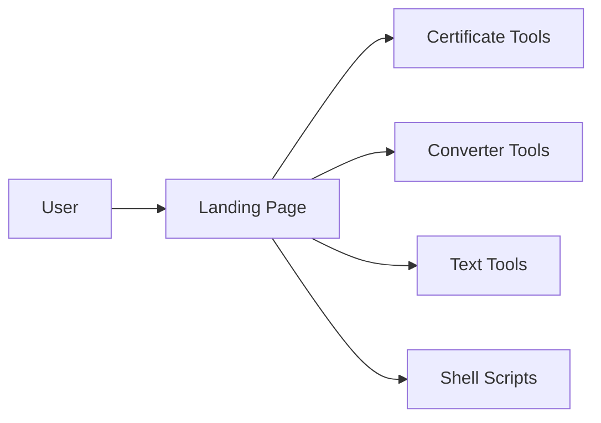
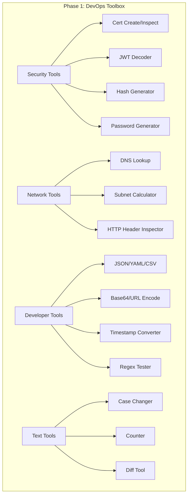
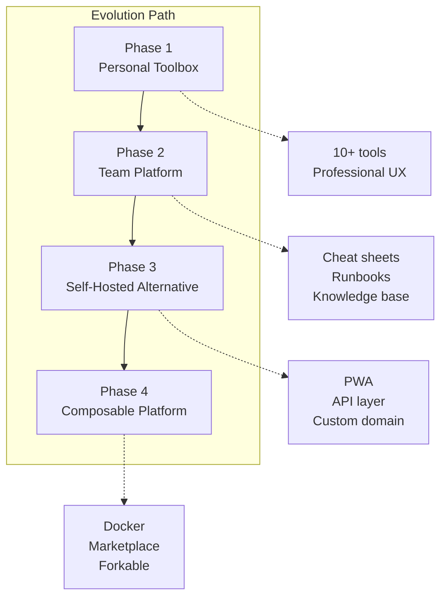

# Evolution Vision — Where This Project Should Go

> Self-reflective document. How the tools platform should evolve from a personal utility collection into something more.

---

## Current State: Personal Utility Belt

Today, this is a GitHub Pages site with ~10 browser-based tools and ~8 shell scripts. It solves the problem of "I don't want to send my certificates to random websites." That's a valid and important niche.

---

## Phase 1: The DevOps Toolbox (Now → 3 Months)

**Vision:** Become the go-to bookmark for platform engineers — a single page where 80% of daily utility needs are met without leaving the browser or trusting third parties.

**Key moves:**
- Add the top 5 missing tools (JWT, timestamp, base64, subnet calc, hash)
- Professional landing page with search and categories
- Dark mode (match the terminal aesthetic)
- "Zero trust" branding — all processing is client-side, nothing leaves the browser

**Success metric:** A platform engineer can go an entire sprint without using jwt.io, subnet-calculator.com, or epochconverter.com.

---

## Phase 2: The Team Platform (3-6 Months)

**Vision:** Not just tools, but team knowledge. Cheat sheets, runbooks, and reference material that lives alongside the tools.

**Key moves:**
- OpenSSL / Kubernetes / Terraform / Docker cheat sheets
- Runbook templates (incident response, cert renewal, DNS migration)
- Searchable knowledge base
- Contribution guide so team members can add tools

**Success metric:** A new team member can onboard faster using these resources. The senior engineer stops answering the same OpenSSL questions.

---

## Phase 3: The Self-Hosted Alternative (6-12 Months)

**Vision:** Position as the privacy-first alternative to scattered third-party tools. "Everything jwt.io, epochconverter.com, and subnet-calc.com do — but nothing leaves your browser."

**Key moves:**
- PWA support (offline access, install to homescreen)
- Custom domain with proper branding
- Privacy-first analytics (Plausible/Umami)
- Plugin architecture — easy to add new tools
- API layer for programmatic access from CI/CD pipelines

**Success metric:** The site is bookmarked by engineers outside the immediate team. GitHub stars > 100.

---

## Phase 4: The Platform (12+ Months)

**Vision:** A composable toolkit that teams can fork, customize, and deploy internally.

**Key moves:**
- Docker image for self-hosted deployment
- Configuration file to enable/disable tools
- Custom branding support (company logo, colors)
- Tool marketplace / community contributions
- Integration with CI/CD pipelines (API endpoints)

**Success metric:** Other teams fork and deploy their own instances. The project becomes a template.

---

## Principles That Should Guide Evolution

### 1. Client-Side First
Every tool should work without a server. No user data should leave the browser. This is the core value proposition — trust.

### 2. Zero Dependencies Where Possible
The fewer external libraries, the fewer supply chain risks. Use the Web Crypto API instead of importing crypto libraries. Use native `Intl` for formatting instead of moment.js.

### 3. Progressive Enhancement
Start with a static HTML page that works without JavaScript. Enhance with JS for interactivity. This keeps tools lightweight and accessible.

### 4. DevOps-Native UX
- Dark mode by default (or at least available)
- Monospace fonts for code output
- Copy-to-clipboard on everything
- Keyboard shortcuts for power users
- Command-line equivalent shown alongside web UI

### 5. Don't Compete With IDEs
Don't try to build a code editor, a Git UI, or a deployment pipeline. These tools complement the IDE and terminal — they don't replace them.

---

## Technical Bets

| Bet | Rationale |
|-----|-----------|
| Stay static (no backend) | Simplicity, free hosting, maximum privacy |
| GitHub Pages for hosting | Zero cost, automatic deployment, tied to source |
| Vanilla JS over frameworks | No build step, instant load, zero dependencies |
| CSS custom properties for theming | Native dark mode without a CSS framework |
| Web Crypto API for hash/key generation | Built into browsers, no library needed |
| DNS-over-HTTPS for network tools | Enables DNS lookups from browser without a backend |

---

## What I Would NOT Do

1. **Don't add a backend** unless absolutely necessary (API layer is the exception, and should be serverless)
2. **Don't add React/Vue/Angular** — the tools are simple enough for vanilla JS, and frameworks add build complexity
3. **Don't monetize** — this is a reputation-builder and team utility, not a SaaS product
4. **Don't chase feature parity** with enterprise tools — be the 80% solution that's 100% trustworthy
5. **Don't add telemetry beyond basic page views** — the audience is security-conscious engineers
